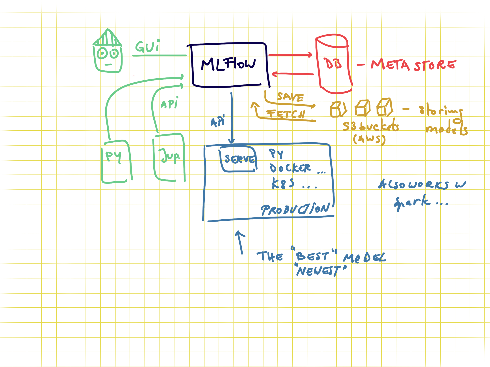

# RevenueMagnetML

Opportunity Prediction as the primary use case. This involves predicting the likelihood of an opportunity closing successfully. It's a valuable scenario for sales teams to prioritize efforts and allocate resources effectively

### Business Impact:

Predicting the success of an opportunity directly impacts revenue and business growth.
It helps in concentrating efforts on opportunities with a higher probability of success, optimizing resource utilization.
Complexity and Challenge:

Predicting whether an opportunity will close successfully is a challenging task, requiring a sophisticated ML model.
It involves handling both numerical and categorical features, as well as dealing with imbalanced classes (more closed-lost opportunities than closed-won).
Decision Support for Sales Teams:

The model's predictions can serve as decision support for sales teams, guiding them on which opportunities to prioritize.
It enhances the efficiency of the sales process by focusing on high-potential opportunities.
Feature Importance Analysis:

Opportunity prediction models often provide insights into which features are most influential in the closing decision.
Understanding these factors can inform strategic decisions and marketing efforts.
Model Evaluation Challenges:

Evaluating the model's performance in terms of precision, recall, and F1-score adds complexity to the project, making it more advanced.
Handling potential class imbalances requires careful consideration.
For the technical aspects, you would likely employ advanced techniques such as ensemble methods (e.g., Random Forests, Gradient Boosting) or even explore more sophisticated models like neural networks. Feature engineering and hyperparameter tuning will play crucial roles in optimizing model performance.

<--------------------------------------------------------------------------------------------------------------->

### **Long-Term Project Objective:**

"To create an intelligent and adaptive RevenueMagnetML system that optimizes sales operations by accurately predicting and prioritizing opportunities, resulting in increased closed-won opportunities, improved revenue outcomes, and enhanced operational efficiency for the organization."

#### Key Components of the Objective:

##### Intelligent and Adaptive System:</br>
Develop an ML-driven system that continuously learns and adapts to changing patterns in sales data.
Incorporate advanced algorithms to enhance the system's intelligence over time.

##### Opportunity Prediction:</br>
Achieve high-precision predictions for opportunities, identifying those most likely to result in successful closures.
Improve the accuracy of revenue forecasting through data-driven insights.

##### Increased Closed-Won Opportunities:</br>
The primary goal is to increase the number of closed-won opportunities by strategically focusing on high-potential prospects.

##### Improved Revenue Outcomes:</br>
Enhance overall revenue outcomes by leveraging predictive analytics to optimize resource allocation and sales strategies.

##### Operational Efficiency:</br>
Contribute to operational efficiency by streamlining sales processes, reducing manual efforts, and providing actionable insights for decision-making.

##### Continuous Improvement:</br>
Establish a framework for ongoing model evaluation and improvement, ensuring that the system remains effective in dynamic business environments.

<--------------------------------------------------------------------------------------------------------------->

## Set up your Environment


### **`macOS`** type the following commands : 

- For installing the virtual environment you can either use the [Makefile](Makefile) and run `make setup` or install it manually with the following commands:

     ```BASH
    make setup
    ```
    After that active your environment by following commands:
    ```BASH
    source .venv/bin/activate
    ```
Or ....
- Install the virtual environment and the required packages by following commands:

    ```BASH
    pyenv local 3.11.3
    python -m venv .venv
    source .venv/bin/activate
    pip install --upgrade pip
    pip install -r requirements.txt
    ```
    
### **`WindowsOS`** type the following commands :

- Install the virtual environment and the required packages by following commands.

   For `PowerShell` CLI :

    ```PowerShell
    pyenv local 3.11.3
    python -m venv .venv
    .venv\Scripts\Activate.ps1
    pip install --upgrade pip
    pip install -r requirements.txt
    ```

    For `Git-bash` CLI :
    ```
    pyenv local 3.11.3
    python -m venv .venv
    source .venv/Scripts/activate
    pip install --upgrade pip
    pip install -r requirements.txt
    ```

    **`Note:`**
    If you encounter an error when trying to run `pip install --upgrade pip`, try using the following command:
    ```Bash
    python.exe -m pip install --upgrade pip
    ```

    ### **`Linux Users`**  : You know what to do :sunglasses:


The `requirements.txt` file contains the libraries needed for deployment.. of model or dashboard .. thus no jupyter or other libs used during development.

The MLFLOW URI should **not be stored on git**, you have two options, to save it locally in the `.mlflow_uri` file:

```BASH
echo http://127.0.0.1:5000/ > .mlflow_uri
```

This will create a local file where the uri is stored which will not be added on github (`.mlflow_uri` is in the `.gitignore` file). Alternatively you can export it as an environment variable with

```bash
export MLFLOW_URI=http://127.0.0.1:5000/
```

This links to your local mlflow, if you want to use a different one, then change the set uri.

The code in the [config.py](modeling/config.py) will try to read it locally and if the file doesn't exist will look in the env var.. IF that is not set the URI will be empty in your code.

## Usage

### Creating an MLFlow experiment

You can do it via the GUI or via [command line](https://www.mlflow.org/docs/latest/tracking.html#managing-experiments-and-runs-with-the-tracking-service-api) if you use the local mlflow:

```bash
mlflow experiments create --experiment-name 0-template-ds-modeling
```

Check your local mlflow

```bash
mlflow ui
```

and open the link [http://127.0.0.1:5000](http://127.0.0.1:5000)

This will throw an error if the experiment already exists. **Save the experiment name in the [config file](modeling/config.py).**

In order to train the model and store test data in the data folder and the model in models run:

```bash
#activate env
source .venv/bin/activate

python -m modeling.train
```

In order to test that predict works on a test set you created run:

```bash
python modeling/predict.py models/linear data/X_test.csv data/y_test.csv
```

## About MLFLOW -- delete this when using the template

MLFlow is a tool for tracking ML experiments. You can run it locally or remotely. It stores all the information about experiments in a database.
And you can see the overview via the GUI or access it via APIs. Sending data to mlflow is done via APIs. And with mlflow you can also store models on S3 where you version them and tag them as production for serving them in production.


### MLFlow GUI

You can group model trainings in experiments. The granularity of what an experiment is up to your usecase. Recommended is to have an experiment per data product, as for all the runs in an experiment you can compare the results.


### Code to send data to MLFlow

In order to send data about your model you need to set the connection information, via the tracking uri and also the experiment name (otherwise the default one is used). One run represents a model, and all the rest is metadata. For example if you want to save train MSE, test MSE and validation MSE you need to name them as 3 different metrics.
If you are doing CV you can set the tracking as nested.


### MLFlow metadata

There is no constraint between runs to have the same metadata tracked. I.e. for one run you can track different tags, different metrics, and different parameters (in cv some parameters might not exist for some runs so this .. makes sense to be flexible).

- tags can be anything you want.. like if you do CV you might want to tag the best model as "best"
- params are perfect for hypermeters and also for information about the data pipeline you use, if you scaling vs normalization and so on
- metrics.. should be numeric values as these can get plotted


